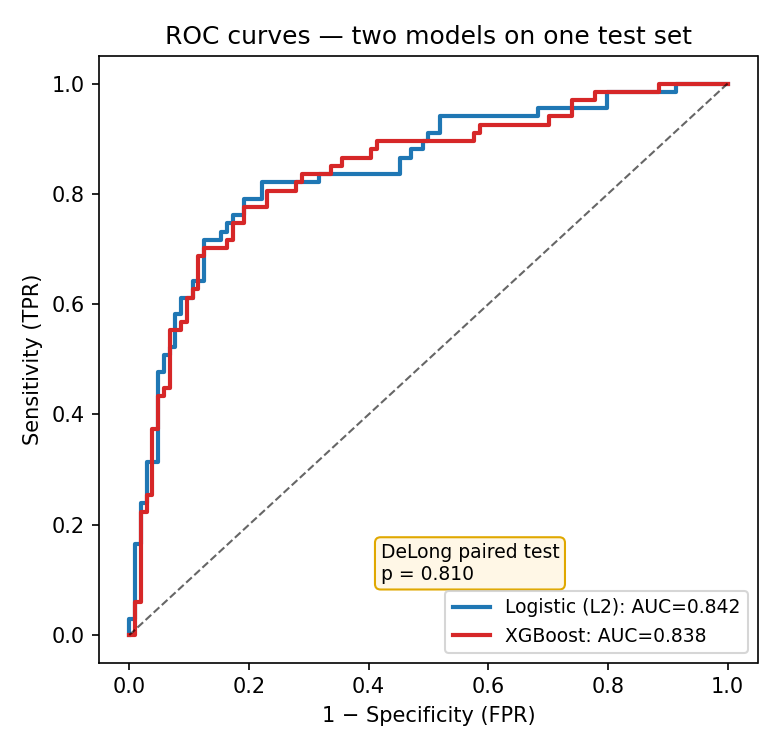
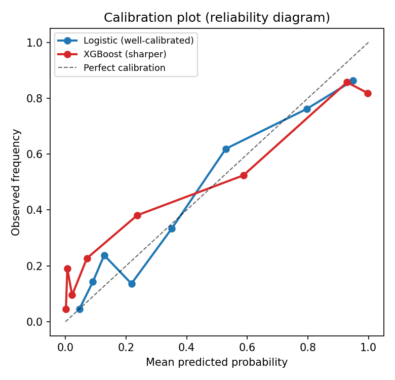

# 의료데이터 통계 검정 — 가정·선택·내부/외부 검증의 교과서

> 의료 인공지능 논문의 **(1) 통계분석** 파트를 위한 레퍼런스. "어떤 변수에 / 어떤 상황에서 / 어떤 가정 아래 / 어떤 검정을 쓰는가"를 수식과 함께 정리한다.
> 자매 노트: 예측모델은 [17. Predictive Modeling Methods](17.PredictiveModelingMethods.md), 해석은 [18. SHAP](18.SHAP.md), 인과 오해석 함정은 [14. Causal Interpretation Pitfalls](14.CausalInterpretationPitfalls.md), 생존분석은 [07. Survival Analysis](07.SurvivalAnaylsis.md)를 함께 본다.
> 본 노트의 모든 인용은 실존 문헌이며 말미에 DOI/URL을 단다. 본문 예시는 다기관 유방 MRI BRCA 연구(Center A=Guro, Center B=Anam)의 실제 분석 코드(`07.table1_baseline_*.py`, `08.table2_logreg.py`)에 근거한다.

---

## 목차

0. [용어 먼저 — 헷갈리는 개념부터 정리](#0-용어-먼저--헷갈리는-개념부터-정리)
1. [가설검정의 기본 골격](#1-가설검정의-기본-골격)
2. [변수 유형과 분포](#2-변수-유형과-분포)
3. [검정 전 가정 점검](#3-검정-전-가정-점검)
4. [의사결정 표 — 어떤 상황에 어떤 검정인가](#4-의사결정-표--어떤-상황에-어떤-검정인가)
5. [두 군 비교 — 연속형](#5-두-군-비교--연속형)
6. [세 군 이상 비교와 사후검정](#6-세-군-이상-비교와-사후검정)
7. [범주형 변수의 검정](#7-범주형-변수의-검정)
8. [상관과 연관성](#8-상관과-연관성)
9. [효과크기](#9-효과크기)
10. [다중비교 보정](#10-다중비교-보정)
11. [회귀 기반 추론 — 로지스틱·Table 2](#11-회귀-기반-추론--로지스틱table-2)
12. [예측모델 평가 통계 — ROC·DeLong·보정·DCA](#12-예측모델-평가-통계--rocdelong보정dca)
13. [생존분석 통계](#13-생존분석-통계)
14. [내부 검증 vs 외부 검증](#14-내부-검증-vs-외부-검증)
15. [실제 연구 적용 사례](#15-실제-연구-적용-사례)
16. [체크리스트와 흔한 오류](#16-체크리스트와-흔한-오류)
17. [참고문헌](#17-참고문헌)

---

## 0. 용어 먼저 — 헷갈리는 개념부터 정리

> 본론에 들어가기 전에, 이 노트 전체에서 계속 나오는 용어를 *쉬운 말로* 먼저 정리한다. 여기만 읽어도 절반은 이해된다.

### 0-1. 가장 헷갈리는 것 — "정규/비정규"와 "모수/비모수"는 같은 말인가?

**아니다. 서로 다른 것을 가리키지만, 짝지어 다닌다.** 많은 사람이 헷갈리는 지점이라 먼저 못박는다.

- **정규 / 비정규**는 *데이터(분포)* 를 묘사하는 말이다.
  - **정규분포(normal distribution)**: 평균을 중심으로 좌우 대칭인 종 모양(bell curve). 예) 성인 키.
  - **비정규(non-normal)**: 한쪽으로 치우치거나(skewed) 봉우리가 여럿인 분포. 예) 종양 크기, 검사수치, 소득.
- **모수적 / 비모수적**은 *검정 방법(통계 기법)* 을 묘사하는 말이다.
  - **모수적 검정(parametric)**: 데이터가 특정 분포(보통 **정규분포**)를 따른다고 *가정*하고 평균·분산 같은 **모수(parameter)** 를 직접 다루는 검정. 예) t-검정, ANOVA, Pearson 상관.
  - **비모수적 검정(non-parametric)**: 분포 가정을 거의 하지 않고, 값 대신 **순위(rank)** 를 쓰는 검정. 예) Mann–Whitney U, Kruskal–Wallis, Spearman 상관.
- **둘의 연결고리(핵심)**:

| 데이터가… | → 쓰는 검정 | 예시 |
|---|---|---|
| **정규분포를 따르면** | **모수적 검정** | t-검정, ANOVA, Pearson |
| **정규분포가 아니면(또는 순서형/소표본)** | **비모수적 검정** | Mann–Whitney, Kruskal–Wallis, Spearman |

  - 즉 "데이터가 정규냐 아니냐(정규/비정규)"를 보고 → "어떤 종류의 검정을 쓰느냐(모수/비모수)"를 정한다.
  - 그래서 [§3 가정 점검](#3-검정-전-가정-점검)에서 **정규성부터 검사**하는 것이다.

### 0-2. 그 밖의 기본 용어 (쉬운 정의)

- **모수(parameter)** vs **통계량(statistic)**:
  - 모수 = 우리가 알고 싶은 *모집단 전체*의 참값(예: 전국 환자의 진짜 평균 나이). 보통 모른다.
  - 통계량 = 우리가 가진 *표본*에서 계산한 값(예: 우리 492명의 평균 나이). 모수의 추정치.
- **변수의 척도(scale)** — [§2](#2-변수-유형과-분포)에서 상세:
  - **연속형(continuous)**: 숫자로 재는 값. 예) 나이, 종양 크기.
  - **범주형(categorical)**: 분류 이름. **명목형**(순서 없음, 예: 혈액형)과 **순서형(ordinal)**(순서 있음, 예: 암 등급 1<2<3)으로 나뉨.
- **귀무가설 $H_0$ / 대립가설 $H_1$**: $H_0$="차이·연관이 없다"(기본 입장), $H_1$="차이·연관이 있다"(보이고 싶은 것).
- **p값(p-value)**: "차이가 없다($H_0$)고 가정했을 때, 지금 본 것만큼 극단적인 결과가 우연히 나올 확률." 작을수록 $H_0$이 의심스럽다. (**$H_0$이 참일 확률이 아니다!**)
- **유의수준 $\alpha$**: p값을 얼마 미만이면 "유의하다"고 할지의 기준선(보통 0.05).
- **일측/양측 검정**: "한쪽 방향만(A>B)" 보면 일측, "양방향 모두(A≠B)" 보면 양측. 의료에서는 보통 **양측**.
- **분할표(contingency table)**: 두 범주형 변수의 빈도를 교차해 적은 표(예: 행=BRCA 양성/음성, 열=기관 A/B). [§7](#7-범주형-변수의-검정)에서 상세.
- **등분산성(homoscedasticity)**: 비교하는 그룹들의 *퍼진 정도(분산)* 가 서로 비슷하다는 것. [§3-2](#3-2-등분산성homoscedasticity)에서 상세.
- **$\chi^2$(읽기: 카이제곱, chi-square)**: 빈도 데이터의 관측값과 기대값 차이를 합산한 검정통계량. 범주형 비교의 핵심.
- **신뢰구간(confidence interval, CI)**: 추정치의 불확실성 범위(예: "OR 2.3, 95% CI 1.4–3.8"). p값보다 정보량이 많다.

---

## 1. 가설검정의 기본 골격

빈도주의 가설검정(Neyman–Pearson 틀)은 **귀무가설** $H_0$(차이/연관 없음)과 **대립가설** $H_1$을 세우고, 관측 데이터가 $H_0$ 아래에서 얼마나 "이례적"인지를 정량화한다.

- **검정통계량** $T$: 데이터를 하나의 수로 요약(예: $t$, $\chi^2$, $U$, $Z$).
- **p-value**: $H_0$이 참일 때 관측값 이상으로 극단적인 통계량이 나올 확률, $p = P(|T| \ge |t_\text{obs}| \mid H_0)$. **p는 "$H_0$이 참일 확률"이 아니다** — 이 오해가 의료 논문 리뷰에서 가장 흔한 지적이다.
- **유의수준** $\alpha$(보통 0.05): 1종 오류(참인 $H_0$ 기각) 허용 확률.
- **2종 오류** $\beta$: 거짓인 $H_0$을 기각하지 못함. **검정력(power)** $= 1-\beta$.
- **효과크기(effect size)**: 차이의 *크기*. p-value는 표본이 커지면 임의로 작아지므로, 임상적 의미는 반드시 효과크기와 신뢰구간으로 보고한다([§9](#9-효과크기)).

검정력은 표본크기 $n$, 효과크기 $\delta$, $\alpha$로 결정된다. 두 군 평균 비교(양측 $t$검정)의 근사 표본크기:

$$
n_\text{per group} \approx \frac{2(z_{1-\alpha/2} + z_{1-\beta})^2 \sigma^2}{\delta^2}
$$

여기서 $z_{1-\alpha/2}=1.96$($\alpha=0.05$), $z_{1-\beta}=0.84$(power 0.80). 의료 예측모델에서는 별도의 **EPV(events per variable)** 와 Riley 등의 표본크기 공식이 더 적절하다([§14](#14-내부-검증-vs-외부-검증), [§11](#11-회귀-기반-추론--로지스틱table-2)).

> **신뢰구간(CI)을 우선하라.** "$p<0.05$"보다 "OR 2.3 (95% CI 1.4–3.8)"이 정보량이 크다. CI는 효과크기, 정밀도, 유의성을 한꺼번에 담는다.

---

## 2. 변수 유형과 분포

검정 선택의 출발점은 **결과/노출 변수의 척도**다.

| 척도 | 예시(의료) | 대표 요약 | 대표 검정 축 |
|---|---|---|---|
| **연속형(정규)** | 나이, BMI, 라디오믹스 entropy | mean ± SD | t/ANOVA, Pearson |
| **연속형(비정규/치우침)** | 종양 크기, PSA, 검사수치 | median [Q1, Q3] | Mann–Whitney/Kruskal–Wallis, Spearman |
| **순서형(ordinal)** | Histologic grade(1/2/3), BI-RADS | median, 빈도 | Cochran–Armitage 추세, Spearman |
| **명목형(2값)** | ER 양성/음성, BRCA+/− | n (%) | χ²(카이제곱)/Fisher, McNemar(대응) |
| **명목형(다값)** | 분자아형(Luminal/HER2/TNBC) | n (%) | χ²(카이제곱) |
| **생존(time-to-event)** | 무재발생존 | KM 곡선, median OS | log-rank, Cox |

핵심 요점:

- 치우친(비정규) 연속형을 평균±SD로 보고하면 분포를 왜곡한다 → **median [Q1, Q3]** 로 보고.
- 그래서 변수마다 **정규성을 먼저 검정**한다([§0-1](#0-1-가장-헷갈리는-것--정규비정규와-모수비모수는-같은-말인가)의 정규→모수 / 비정규→비모수 규칙).
- 우리 Table 1 코드는 정규면 `mean ± SD`, 비정규면 `median [Q1, Q3]`로 자동 분기한다 — 이것이 정석이다.

---

## 3. 검정 전 가정 점검

- 모수 검정(t, ANOVA, Pearson)은 **가정(전제 조건)** 위에서 작동한다.
- 가정이 깨진 채로 모수 검정을 쓰면, 1종 오류율(거짓 양성)이 명목 $\alpha$(0.05)를 벗어나 결과를 못 믿게 된다.
- 그래서 검정을 *하기 전에* 세 가지 가정 — **정규성·등분산성·독립성** — 을 점검한다.

### 3-1. 정규성(normality)

**정규성 = 데이터가 좌우 대칭 종 모양(정규분포)에 가까운가.** 이것이 충족되면 모수 검정(t/ANOVA)을, 아니면 비모수 검정을 쓴다([§0-1](#0-1-가장-헷갈리는-것--정규비정규와-모수비모수는-같은-말인가)).

- **Shapiro–Wilk 검정** *(Shapiro & Wilk 1965)*: 표본 정규성 검정의 표준. 작은 표본($n<50$)에서 검정력이 특히 우수하다. 검정통계량 $W$는 다음과 같다.

$$
W = \frac{\left(\sum_{i=1}^{n} a_i\, x_{(i)}\right)^2}{\sum_{i=1}^{n}\left(x_i - \bar{x}\right)^2}
$$

  수식의 각 항을 풀면:
  - $x_{(i)}$ : 데이터를 **작은 값부터 정렬**했을 때 $i$번째 값(순서통계량).
  - $a_i$ : 정규분포의 순서통계량 기대값·공분산에서 미리 유도된 **상수 가중치**.
  - $\bar{x}$ : 표본 평균.
  - 분자 = "데이터가 정규분포 순서를 얼마나 잘 따르는가", 분모 = "데이터의 총 변동(분산)".
  - 해석: $W$가 **1에 가까울수록 정규**에 가깝다. p값 $>0.05$이면 "정규를 벗어났다는 증거 없음".
- **Kolmogorov–Smirnov / Lilliefors, Anderson–Darling**: 대표본에서 쓰는 보조 수단.
- **Q–Q plot(분위수-분위수 그림)**: 데이터 분위수를 정규분포 분위수와 점으로 비교. 점이 직선이면 정규. **검정 p값보다 이 시각적 진단이 더 신뢰성 있다.**
  - 주의: **대표본에서는 아주 미세한 비정규도 p값이 유의**하게 나온다 → Shapiro의 p값만 맹신하지 말고 Q–Q plot을 함께 본다.

> 실무 분기(우리 코드): 비교하려는 *모든 하위군*에서 Shapiro $p>0.05$ → 모수 경로(t/ANOVA), 하나라도 $p\le0.05$ → 비모수 경로(Mann–Whitney/Kruskal–Wallis).

### 3-2. 등분산성(homoscedasticity)

**등분산성 = 비교하는 그룹들의 "퍼진 정도(분산)"가 서로 비슷한가.** ("등(等)" = 같다, "분산" = 흩어진 정도.)

- 쉬운 비유: 두 반의 평균 점수를 비교할 때, 한 반은 점수가 60~62점에 몰려 있고 다른 반은 20~100점으로 넓게 퍼져 있다면 — 평균이 같아도 "퍼짐"이 전혀 다르다. 이때 **등분산이 깨졌다**고 한다.
- 왜 중요한가: Student t-검정·ANOVA는 "두 그룹의 분산이 같다"고 가정한다. 이 가정이 깨지면 검정 결과(특히 표본 크기가 다를 때)가 왜곡된다.
- 어떻게 점검하나:
  - **Levene 검정** *(Levene 1960)*: 각 값이 자기 그룹 평균에서 얼마나 떨어졌는지($z_{ij}=|x_{ij}-\bar{x}_j|$)를 계산해, 그 절대편차들을 그룹 간 비교(ANOVA). p값 $\le0.05$이면 "분산이 다르다".
  - 중앙값 기반 변형(**Brown–Forsythe**)은 비정규 데이터에 더 강건하다.
- 깨졌으면 어떻게 하나:
  - **Welch 보정**(Welch t / Welch ANOVA)으로 간다 — 등분산을 가정하지 않는 버전.
  - 현대 통계 관행은 "굳이 등분산을 따지지 말고 **처음부터 Welch를 기본값으로** 쓰라"고 권장한다 *(Delacre et al. 2017)*.

### 3-3. 독립성(independence)

**독립성 = 한 관측치가 다른 관측치에 영향을 주지 않는가.**

- 위반되는 흔한 경우:
  - **같은 환자의 양쪽 유방**(좌/우)을 각각 한 건으로 셈 → 서로 닮아 독립이 아님.
  - **같은 환자의 반복 측정**(전/후, 여러 시퀀스).
  - **군집 표본**(같은 기관·같은 의사에서 나온 환자들).
- 처리 방법:
  - 혼합효과모형(mixed model)·GEE로 군집을 보정.
  - 또는 대응표본 전용 검정(paired t / Wilcoxon signed-rank / McNemar)을 사용.
- 다기관 데이터에서 *기관(center)* 은 대표적인 군집 변수다.

---

## 4. 의사결정 표 — 어떤 상황에 어떤 검정인가

> 핵심 한 장. "비교 구조 × 척도 × 가정"으로 검정을 고른다.

| 비교 구조 | 척도/가정 | 검정 | 대응(쌍체) 버전 |
|---|---|---|---|
| 2군 평균 | 연속·정규·등분산 | **Student t** | paired t |
| 2군 평균 | 연속·정규·이분산 | **Welch t**(기본 권장) | paired t |
| 2군 분포 | 연속·비정규 | **Mann–Whitney U** | **Wilcoxon signed-rank** |
| ≥3군 | 연속·정규·등분산 | **One-way ANOVA** | Repeated-measures ANOVA |
| ≥3군 | 연속·정규·이분산 | **Welch ANOVA** | — |
| ≥3군 | 연속·비정규 | **Kruskal–Wallis** | Friedman |
| 사후(정규·등분산) | — | **Tukey HSD** | — |
| 사후(정규·이분산) | — | **Games–Howell** | — |
| 사후(비모수) | — | **Dunn**(+보정) | — |
| 2값×2값 빈도 | 기대도수 모두 ≥5 | **Pearson χ²(카이제곱)** | **McNemar** |
| 2값×2값 빈도 | 기대도수 <5 존재 | **Fisher exact** | McNemar exact |
| 2값 × 순서 노출 | 용량–반응 추세 | **Cochran–Armitage 추세** | — |
| 두 연속 연관 | 정규·선형 | **Pearson r** | — |
| 두 연속 연관 | 비정규·단조 | **Spearman ρ / Kendall τ** | — |
| 두 AUC 비교 | 같은 표본 | **DeLong**(correlated ROC) | DeLong(paired) |
| 생존 곡선 비교 | time-to-event | **Log-rank** | — |

> ⚠️ "**기대도수 <5 → Fisher**"는 *expected*(기대) 도수 기준이지 관측도수가 아니다(Cochran's rule). 우리 Table 1 코드는 2×2의 기대도수를 계산해 모두 ≥5면 χ²(카이제곱), 하나라도 <5면 Fisher로 자동 분기한다.

---

## 5. 두 군 비교 — 연속형

**배경 먼저 — t-검정은 무엇을 하나?**

- 상황: "기관 A 환자와 기관 B 환자의 *평균 나이*가 다른가?"처럼 **두 그룹의 평균**을 비교하고 싶다.
- 핵심 아이디어: 두 평균의 **차이**를, 그 차이가 우연히 흔들리는 정도(**표준오차**)로 나눈다.

$$
t = \frac{\text{두 그룹 평균의 차이}}{\text{그 차이의 표준오차(불확실성)}}
$$

- 직관: 분자(차이)가 크고 분모(불확실성)가 작을수록 $t$가 커지고 → "우연이 아니다"는 신호가 강해진다.
- 어떤 버전을 쓰나(가정에 따라):
  - 정규 + **등분산** → **Student t**([§5-1](#5-1-student-t-검정-등분산))
  - 정규 + **이분산** → **Welch t**([§5-2](#5-2-welch-t-검정-이분산-권장-기본값), 권장 기본값)
  - **비정규** → **Mann–Whitney U**([§5-3](#5-3-mannwhitney-u-비모수), 순위 기반 비모수)

### 5-1. Student t-검정 (등분산)

두 독립 표본 $n_1, n_2$, 표본평균 $\bar{x}_1,\bar{x}_2$. 합동분산(pooled variance, 두 그룹 분산을 표본수로 가중평균한 것)

$$
s_p^2 = \frac{(n_1-1)s_1^2 + (n_2-1)s_2^2}{n_1+n_2-2}, \qquad
t = \frac{\bar{x}_1 - \bar{x}_2}{s_p\sqrt{\tfrac{1}{n_1}+\tfrac{1}{n_2}}}, \quad df = n_1+n_2-2
$$

$H_0$ 아래 $t$는 자유도 $df$의 t-분포를 따른다 *(Student 1908)*.

### 5-2. Welch t-검정 (이분산, 권장 기본값)

등분산을 가정하지 않는다 *(Welch 1947)*:

$$
t = \frac{\bar{x}_1 - \bar{x}_2}{\sqrt{\tfrac{s_1^2}{n_1}+\tfrac{s_2^2}{n_2}}}, \qquad
df \approx \frac{\left(\tfrac{s_1^2}{n_1}+\tfrac{s_2^2}{n_2}\right)^2}{\dfrac{(s_1^2/n_1)^2}{n_1-1}+\dfrac{(s_2^2/n_2)^2}{n_2-1}}
$$

(Welch–Satterthwaite 자유도). 표본크기·분산이 다를 때 1종 오류율을 더 잘 통제한다.

### 5-3. Mann–Whitney U (비모수)

정규성이 깨지거나 순서형일 때. 두 표본을 합쳐 순위(rank)를 매기고, 1군의 순위합 $R_1$로부터

$$
U_1 = R_1 - \frac{n_1(n_1+1)}{2}, \qquad U = \min(U_1, U_2)
$$

$H_0$: 두 분포가 동일(확률적 우열 없음). $P(X>Y)=P(Y>X)$를 검정 *(Mann & Whitney 1947; Wilcoxon 1945)*. 효과크기는 $r = Z/\sqrt{N}$ 또는 Cliff's δ, AUC=$U/(n_1 n_2)$(즉 **Mann–Whitney U와 ROC-AUC는 동치**).

### 5-4. 대응표본

- **Paired t**: 차이 $d_i=x_i-y_i$의 평균을 0과 비교. $t = \bar{d}/(s_d/\sqrt{n})$.
- **Wilcoxon signed-rank** *(Wilcoxon 1945)*: 차이의 절대값 순위에 부호를 부여한 합. 비정규 대응자료(같은 환자 전/후, 같은 종양 두 시퀀스).

---

## 6. 세 군 이상 비교와 사후검정

**배경 먼저 — 왜 t-검정을 여러 번 하면 안 되나?**

- 상황: 그룹이 3개 이상(예: Luminal vs HER2 vs TNBC의 평균 종양 크기).
- 단순한 생각: "쌍마다 t-검정을 반복하면 되지 않나?" → **안 된다.** 비교를 여러 번 하면 우연히 유의해질 확률이 누적된다([§10 다중비교](#10-다중비교-보정)).
- 해결: 먼저 **전반 검정(omnibus)** 으로 "어딘가 차이가 있는가?"를 한 번에 묻고(ANOVA / Kruskal–Wallis), 유의하면 그제서야 **사후검정(post-hoc)** 으로 "어느 쌍이 다른가?"를 본다.
- ANOVA의 핵심 아이디어: 전체 흩어짐을 **"그룹 사이의 차이(between)"** 와 **"그룹 안의 잡음(within)"** 으로 쪼개, 그 비율($F$)이 크면 "그룹 간 차이가 잡음보다 크다"고 판단.

### 6-1. One-way ANOVA

총변동을 군간(between)·군내(within)로 분해:

$$
F = \frac{\text{MS}_\text{between}}{\text{MS}_\text{within}} = \frac{\sum_j n_j(\bar{x}_j-\bar{x})^2/(k-1)}{\sum_j\sum_i (x_{ij}-\bar{x}_j)^2/(N-k)}
$$

$H_0$: 모든 군 평균이 같다. 가정 위반 시 **Welch ANOVA**(이분산), **Kruskal–Wallis**(비정규).

### 6-2. Kruskal–Wallis (비모수)

순위 기반 일원배치 *(Kruskal & Wallis 1952)*:

$$
H = \frac{12}{N(N+1)}\sum_{j=1}^{k} \frac{R_j^2}{n_j} - 3(N+1)
$$

$R_j$는 $j$군 순위합. $H \sim \chi^2_{k-1}$(근사).

### 6-3. 사후검정(post-hoc) — 다중성 통제 필수

전반(omnibus) 검정이 유의하면 *어느 쌍이 다른지* 보되, 쌍별 비교는 다중비교 보정이 필요하다([§10](#10-다중비교-보정)).

- **Tukey HSD**: 정규·등분산, 모든 쌍, family-wise error 통제.
- **Games–Howell**: 정규·이분산.
- **Dunn 검정** *(Dunn 1964)*: Kruskal–Wallis 후 비모수 쌍별, Bonferroni/BH로 보정.

---

## 7. 범주형 변수의 검정

### 7-0. 먼저 — 분할표(contingency table)란?

범주형 검정은 거의 모두 **분할표** 위에서 이루어진다. 먼저 이게 뭔지부터 잡고 가자.

- **분할표 = 두 범주형 변수의 빈도를 가로·세로로 교차해 적은 표.** "교차표(cross-tabulation)"라고도 한다.
- 예시(2×2 분할표): 행 = BRCA 변이(양성/음성), 열 = 기관(A/B).

| | 기관 A | 기관 B | 행 합계 |
|---|---|---|---|
| **BRCA 양성** | $a$ | $b$ | $a+b$ |
| **BRCA 음성** | $c$ | $d$ | $c+d$ |
| **열 합계** | $a+c$ | $b+d$ | $N$ |

- 각 칸의 값(예: $a$)은 **관측도수(observed)** = 실제로 그 조합에 속한 환자 수.
- **기대도수(expected)** = "두 변수가 아무 관련이 없다($H_0$)면 이 칸에 몇 명이 있을까"를 행·열 합계로 계산한 값.
- 범주형 검정의 핵심 질문: **관측도수가 기대도수에서 얼마나 벗어났는가?** 많이 벗어날수록 "두 변수는 관련 있다($H_1$)".
- $r\times c$ 표 = 행 $r$개, 열 $c$개. 위 예는 $2\times2$.

### 7-1. Pearson χ²(카이제곱) 검정 — 독립성/적합도

- **무엇**: 관측도수 $O_{ij}$와 기대도수 $E_{ij}$의 차이를 칸마다 제곱해 합산. 클수록 "관련 있다".
- **언제**: 두 범주형 변수의 연관(예: 기관 vs BRCA), 표본이 충분히 클 때.
- 기대도수 $E_{ij}=\dfrac{(\text{행 합})\times(\text{열 합})}{N}$, 검정통계량 *(Pearson 1900)*:

$$
\chi^2 = \sum_{i,j}\frac{(O_{ij}-E_{ij})^2}{E_{ij}}, \qquad df=(r-1)(c-1)
$$

- 수식 풀이: 각 칸에서 (관측−기대)를 제곱하고 기대로 나눠 합산. $df$(자유도)는 표 크기로 정해진다.
- **유효성 조건(언제 쓰면 안 되나)**: 기대도수의 80% 이상이 ≥5이고 모든 칸이 ≥1이어야 한다(Cochran's rule). 이 조건이 깨지면 → **Fisher exact**([§7-2](#7-2-fisher-exact)).
- 2×2에서 Yates 연속성 보정은 논쟁적 — 표본이 작으면 보정 대신 Fisher가 낫다.

### 7-2. Fisher exact

작은 표본/희소 칸. 2×2 분할표의 주변합을 고정하고 초기하분포로 정확확률을 계산:

$$
P = \frac{\binom{a+b}{a}\binom{c+d}{c}}{\binom{N}{a+c}} = \frac{(a+b)!(c+d)!(a+c)!(b+d)!}{a!\,b!\,c!\,d!\,N!}
$$

관측표 이상으로 극단적인 표들의 확률을 합산 *(Fisher 1922, 1935)*. 희귀 변이(BRCA1/2)·소표본 다기관 비교에서 자주 쓴다.

### 7-3. McNemar (대응 2값)

같은 대상의 두 이분형 측정(예: 같은 환자에서 두 판독기 양성 여부). 불일치 칸 $b, c$만 사용 *(McNemar 1947)*:

$$
\chi^2 = \frac{(b-c)^2}{b+c} \quad (\text{소표본: 정확검정})
$$

두 모델의 **민감도/특이도 비교**, 두 진단법 일치 비교에 쓴다.

### 7-4. Cochran–Armitage 추세검정

노출이 **순서형**(grade 1<2<3, 용량 단계)일 때 단순 χ²는 순서를 버린다. 추세검정은 *용량–반응 단조성*을 검정한다 *(Cochran 1954; Armitage 1955)*. 점수 $x_j$를 부여하고 양성비율의 선형 추세 기울기를 검정. 우리 Table 1의 "Cochran 버전"이 이 경로다.

---

## 8. 상관과 연관성

**배경 먼저 — 상관(correlation)이란?**

- 상관 = **두 변수가 함께 변하는 정도**(예: 종양 크기가 커지면 entropy도 커지는가?).
- 상관계수는 보통 **−1 ~ +1** 사이: +1=완전 같은 방향, 0=관계 없음, −1=완전 반대 방향.
- 어떤 계수를 쓰나(데이터 성격에 따라):
  - **Pearson** = *선형* 관계, 연속·정규에 적합.
  - **Spearman / Kendall** = *순위* 기반, 비정규·순서형·곡선형(단조) 관계에 강건.
- ⚠️ **상관 ≠ 인과.** 상관이 높아도 한쪽이 다른 쪽의 원인이라는 뜻은 아니다([14. Causal Interpretation Pitfalls](14.CausalInterpretationPitfalls.md)).

- **Pearson r**: 선형·연속·정규. $r=\frac{\sum(x_i-\bar x)(y_i-\bar y)}{\sqrt{\sum(x_i-\bar x)^2}\sqrt{\sum(y_i-\bar y)^2}}$. 이상치·비선형에 취약.
- **Spearman ρ** *(Spearman 1904)*: 순위 상관. 단조(monotonic) 관계, 비정규·순서형에 강건. 값을 순위로 바꾼 뒤 Pearson을 적용한 것.
- **Kendall τ**: concordant/discordant 쌍의 비율. 소표본·결측 많을 때 ρ보다 안정적.
- **연관성 효과크기**: 2×2는 **Cramér's V**(=φ), OR, RR.

> 다중공선성: 라디오믹스처럼 변수가 강하게 상관될 때(예: shape 계열) 상관행렬·VIF로 중복을 점검하고, 회귀·SHAP 해석 시 [14. Causal Interpretation Pitfalls](14.CausalInterpretationPitfalls.md)의 경고를 따른다.

---

## 9. 효과크기

p-value 없이 *크기*만 말하는 지표. 표본크기와 무관하게 임상적 의미를 전달한다.

| 비교 | 효과크기 | 정의/해석 |
|---|---|---|
| 2군 평균 | **Cohen's d** | $d=(\bar x_1-\bar x_2)/s_p$. 0.2/0.5/0.8 = 소/중/대 |
| 2군 평균(소표본 보정) | **Hedges' g** | $d$에 $(1-\tfrac{3}{4(n_1+n_2)-9})$ 보정 |
| 비모수 2군 | **Cliff's δ / rank-biserial** | 확률적 우열 |
| 2×2 | **Odds Ratio, Risk Ratio** | OR=$\frac{ad}{bc}$ |
| 분할표 연관 | **Cramér's V** | $\sqrt{\chi^2/(N\cdot\min(r-1,c-1))}$ |
| 회귀 설명력 | **R², pseudo-R²(McFadden)** | — |

Cohen의 관습적 절단값은 *맥락 의존적*이며, 분야 표준(예: 영상 바이오마커)이 우선한다.

---

## 10. 다중비교 보정

검정을 $m$번 하면 적어도 한 번 우연히 유의할 확률(FWER)은 $1-(1-\alpha)^m$로 커진다. $m=20$이면 0.64. 라디오믹스(수백~수천 feature), 다중 하위군, 다중 패러다임 비교에서 **보정은 필수**다.

| 방법 | 통제 대상 | 절차 | 특징 |
|---|---|---|---|
| **Bonferroni** | FWER | $p_i \le \alpha/m$ 기각 | 가장 보수적, 단순 |
| **Holm** *(Holm 1979)* | FWER | p 오름차순 정렬, $p_{(k)}\le \alpha/(m-k+1)$ 순차 | Bonferroni보다 항상 강함(uniformly more powerful) |
| **Benjamini–Hochberg** *(B&H 1995)* | **FDR** | p 오름차순, $p_{(k)}\le \tfrac{k}{m}\alpha$ 만족하는 최대 $k$까지 기각 | 발견 지향, 고차원에 적합 |

> **FWER vs FDR**: 확증적(confirmatory) 1차 가설 → Holm/Bonferroni. 탐색적(exploratory) 고차원 스크리닝(라디오믹스, 오믹스) → BH-FDR. 무엇을 보정했는지/안 했는지 본문에 명시한다.

---

## 11. 회귀 기반 추론 — 로지스틱·Table 2

### 11-1. 로지스틱 회귀

이진 결과 $y\in\{0,1\}$의 로그-오즈를 선형 모델링:

$$
\log\frac{P(y=1\mid x)}{1-P(y=1\mid x)} = \beta_0 + \sum_j \beta_j x_j
\quad\Rightarrow\quad
\text{OR}_j = e^{\beta_j}
$$

계수는 최대우도(MLE)로 추정([17번 노트 §2](17.PredictiveModelingMethods.md) 참조). 우리 Table 2 코드는 `statsmodels.Logit`로 각 변수의 **OR과 95% CI**($e^{\beta\pm1.96\,\text{SE}}$), Wald p를 보고한다.

- **단변량 → 다변량**: 단변량 $p<0.05$ 변수만 다변량에 투입(우리 코드의 `P_MV_THRESHOLD=0.05`). 더 엄밀하게는 임상지식 기반 사전선택 + EPV 고려가 권장된다.
- **Wald vs LRT**: 소표본·완전분리(separation)에서는 Wald가 불안정 → 우도비검정(LRT)·Firth 벌점우도 권장.

### 11-2. "Table 2 오류"를 피하라

다변량 모델의 *모든* 계수를 동등하게 "위험인자"로 해석하면 안 된다. 한 변수의 조정계수는 *다른 변수들의 역할에 따라 교란·매개·collider가 섞여* 인과적으로 오독될 수 있다 *(Westreich & Greenland 2013)*. 자세한 함정과 의료 사례는 [14. Causal Interpretation Pitfalls](14.CausalInterpretationPitfalls.md). **연관(association)은 인과가 아니다.**

---

## 12. 예측모델 평가 통계 — ROC·DeLong·보정·DCA

예측모델 논문에서 "(2) 예측분석"의 결과를 *통계적으로* 방어하는 부분.

### 12-1. 판별력(discrimination): ROC-AUC

ROC는 임계값을 쓸어가며 (1−특이도, 민감도)를 그린 곡선. AUC는 "무작위 양성 환자가 무작위 음성보다 높은 점수를 받을 확률" = Mann–Whitney U 통계량과 동일 *(Hanley & McNeil 1982)*:

$$
\text{AUC} = P(\hat{s}_{+} > \hat{s}_{-}) = \frac{U}{n_+ n_-}
$$

### 12-2. 두 AUC 비교 — DeLong

같은 표본에서 모델 A vs B의 AUC를 비교하면 두 추정치가 *상관*된다. **DeLong 검정**은 구조적 성분(placement values)의 공분산을 추정해 상관을 반영한 분산으로 검정한다 *(DeLong, DeLong & Clarke-Pearson 1988)*:

$$
Z = \frac{\widehat{\text{AUC}}_A - \widehat{\text{AUC}}_B}{\sqrt{\widehat{\mathrm{Var}}(\widehat{\text{AUC}}_A - \widehat{\text{AUC}}_B)}}
$$

**잠깐 — "공분산(covariance)"이 무슨 뜻인가?** (이게 DeLong의 핵심이다.)

- **공분산 = 두 값이 "함께 움직이는 정도".**
  - 한쪽이 커질 때 다른 쪽도 커지면 → **양(+)의 공분산**.
  - 한쪽이 커질 때 다른 쪽은 작아지면 → **음(−)의 공분산**.
  - 서로 무관하게 움직이면 → 공분산 **0**.
- **분산(variance)** 은 "한 값이 혼자 흔들리는 정도", **공분산**은 "두 값이 *같이* 흔들리는 정도"다. (상관계수는 공분산을 −1~+1로 표준화한 것.)
- **왜 DeLong에 필요한가**: 두 모델을 **같은 환자들**에게 적용하면, "쉬운 환자"가 두 모델 모두에서 점수가 높다 → 두 AUC가 **함께 출렁인다(양의 공분산)**.
  - 차이 $A-B$의 분산 공식은 $\mathrm{Var}(A)+\mathrm{Var}(B)-2\,\mathrm{Cov}(A,B)$ 이다.
  - 공분산이 양수($+$)이면 마지막 항 $-2\mathrm{Cov}$가 분산을 **줄여준다** → 분모가 작아져 같은 차이도 더 쉽게 유의해진다(검정력↑).
  - 만약 이 공분산을 무시하고 두 AUC가 독립이라 가정하면, 차이의 분산을 **과대평가**해 진짜 차이를 놓친다.
- 한 줄: **"같은 환자라서 두 모델 점수가 함께 움직이는 부분(공분산)을 빼주는 것"** 이 DeLong이 일반 비교와 다른 핵심이다.

우리 연구는 패러다임 간(예: CL+RA RF vs Image) AUC 비교에 DeLong을 쓴다(`_summary/delong_*.csv`). 독립 표본(외부 코호트)이면 비상관 분산을, 짝지어진(같은 환자) 경우 공분산을 포함한다.



> 같은 검정셋에서 로지스틱(AUC 0.842)과 XGBoost(0.838)를 비교한 예. 두 곡선이 거의 겹치고 **DeLong paired p=0.81** — "AUC가 0.004 높다"는 *통계적으로 무의미*하다. AUC 숫자만 보고 우열을 주장하면 안 되는 이유를 보여준다. (생성: [`assets/make_figures.py`](assets/make_figures.py))

### 12-3. 신뢰구간 — 부트스트랩

AUC·민감도·NRI 등의 CI는 **부트스트랩** *(Efron 1979)* 으로 구한다: 환자 단위로 $B$회 복원추출, 매번 지표를 계산, 2.5–97.5 백분위수가 95% CI. 영상모델에서는 환자 단위 재추출이 누수를 막는다.

### 12-4. 보정(calibration) — 판별만큼 중요

판별이 좋아도 *확률이 틀리면* 임상 의사결정이 왜곡된다.

- **Calibration plot**: 예측확률 vs 관측빈도. 이상은 대각선.
- **Calibration slope / intercept**: slope<1 → 과적합(예측이 과도하게 극단). 외부검증에서 slope가 특히 진단적이다 *(Steyerberg & Vergouwe 2014)*.
- **Hosmer–Lemeshow** *(Hosmer & Lemeshow 1980)*: 예측확률 십분위(decile) 그룹의 관측/기대 비교, $\hat{C}\sim\chi^2_{g-2}$. 대표본에서 과민·검정력 낮음 → 보조 지표로만.
- **Brier score**: $\frac{1}{n}\sum(\hat p_i - y_i)^2$. 판별+보정을 합친 적정성 점수.



> 신뢰도 다이어그램(reliability diagram): 예측확률을 8분위로 묶어 *예측확률 vs 실제 빈도*를 그린다. 대각선이 완벽 보정. 위 예에서 XGBoost는 양극단에서 과신(낮은 확률은 더 높게, 높은 확률은 더 낮게 관측)하는 전형적 패턴을 보인다. **판별(AUC)이 같아도 보정은 다를 수 있다** — 그래서 둘을 함께 보고한다.

### 12-5. 임상 유용성 — DCA

**Decision Curve Analysis** *(Vickers & Elkin 2006)*: 임계확률 $p_t$ 범위에서 **net benefit** = $\frac{\text{TP}}{n} - \frac{\text{FP}}{n}\cdot\frac{p_t}{1-p_t}$ 를 "treat all/treat none"과 비교. AUC·보정을 넘어 *결정 수준의* 이득을 보여, 의료 리뷰어가 점점 요구한다.

---

## 13. 생존분석 통계

time-to-event 결과(무재발생존 등)는 **중도절단(censoring)** 때문에 t/로지스틱을 쓸 수 없다.

- **Kaplan–Meier** 추정량 *(Kaplan & Meier 1958)*: $\hat S(t)=\prod_{t_i\le t}\bigl(1-\tfrac{d_i}{n_i}\bigr)$.
- **Log-rank 검정** *(Mantel 1966)*: 군 간 생존곡선 차이. 각 사건시점의 관측–기대 사건수를 누적한 $\chi^2$.
- **Cox 비례위험모형** *(Cox 1972)*: $h(t\mid x)=h_0(t)\exp(\beta^\top x)$, $e^{\beta_j}$=hazard ratio. 비례위험 가정(Schoenfeld 잔차)·C-index·IBS 평가는 [07. Survival Analysis](07.SurvivalAnaylsis.md)에서 상세히 다룬다.

---

## 14. 내부 검증 vs 외부 검증

예측모델 신뢰성의 핵심. **TRIPOD/TRIPOD+AI** *(Collins et al. 2015; Collins et al. 2024; Moons et al. 2015)* 가 보고 표준이다.

### 14-1. 검증의 위계 (Steyerberg)

| 수준 | 방법 | 무엇을 답하나 |
|---|---|---|
| **Apparent** | 학습 데이터에서 평가 | (낙관적, 보고만으로는 불충분) |
| **Internal** | CV / bootstrap / split | 같은 모집단 *재현성*·과적합 보정 |
| **Internal–External** | leave-one-center-out | 기관 간 *이식성* 예비 평가 |
| **External** | 별도 시·공간 코호트 | *일반화*(temporal/geographic/domain) |

### 14-2. 내부 검증 기법

- **K-fold CV**: 데이터를 $K$등분, 매번 1 fold 검증. 분류는 **stratified** K-fold로 클래스 비율 유지. 소표본 의료 데이터에서 단일 split은 분산이 커, **반복(repeated) CV**나 다중 seed로 안정성을 본다(우리 연구는 5-seed/10-split 반복).
- **Nested CV**: 하이퍼파라미터 튜닝을 *내부* 루프에, 성능 추정을 *외부* 루프에 둬, 튜닝으로 인한 낙관 편향을 제거. 모델선택과 평가가 같은 데이터를 보면 성능이 부풀려진다.
- **Bootstrap optimism 보정** *(Efron 1979; Harrell)*: apparent 성능에서 optimism(=bootstrap apparent − bootstrap test)을 빼 보정. 소표본에서 split보다 효율적.
- **누수(leakage) 금지**: 스케일러·결측대치·오버샘플링(SMOTE)·feature 선택은 **fold 내부에서** 학습 데이터에만 적합해야 한다([00번 노트](00.PredicvtiveModeling.md)의 경고). 전체 데이터로 전처리 후 CV = 흔한 치명적 누수.

### 14-3. 외부 검증

- **Temporal**: 다른 시기 환자. **Geographic**: 다른 기관/스캐너. **Domain shift**: 분포 이동([09. Domain Generalization](09.DomainGeneralization.md)).
- 외부에서는 **판별(AUC) 하락보다 보정(calibration) 붕괴가 먼저** 온다. slope·intercept를 반드시 보고.
- 우리 BRCA 연구의 핵심 설계: Center A→B, B→A **교차 외부검증** + 통합 5-fold. 내부 AUC와 외부 AUC의 격차가 곧 일반화 갭이다.

### 14-4. 표본크기·EPV

로지스틱/Cox는 **EPV(events per variable) ≥ 10**이 고전 경험칙이나, Riley 등의 현대 공식(원하는 shrinkage·보정 기준)이 더 정확하다. 희귀 결과(BRCA1/2 소수 클래스)에서 다변량 변수 수를 제한하는 근거.

---

## 15. 실제 연구 적용 사례

다기관 유방 MRI BRCA 연구에서 위 도구가 어떻게 맞물리는지(코드 근거: `07.table1_baseline_*.py`, `08.table2_logreg.py`, `_summary/delong_*.csv`).

**Table 1 — Baseline characteristics(군 비교).**
1. 연속형(나이, 라디오믹스 entropy/contrast 등): 4개 하위군 모두 Shapiro $p>0.05$ → Welch t + `mean±SD`, 하나라도 비정규 → Mann–Whitney + `median [Q1,Q3]`.
2. 2값(ER/PR/HER2, grade 3, MRI semantic feature): 2×2 기대도수 모두 ≥5 → Pearson χ², <5 존재 → Fisher exact.
3. 순서형 노출(필요 시): Cochran–Armitage 추세.
4. p는 소수 셋째자리, `<0.001` 표기.

**Table 2 — 로지스틱 회귀(연관).** Center A 학습셋에서 단변량 로지스틱으로 OR(95% CI)·p 산출 → $p<0.05$ 변수만 다변량 투입. 해석은 *연관*으로 한정하고 Table 2 오류를 경계.

**예측 성능 비교(DeLong).** 패러다임별 최고 모델(예: CL+RA RF vs Image-only)의 외부검증 AUC를 DeLong으로 비교, 부트스트랩 95% CI 병기. 다중 비교가 많으면 BH-FDR로 보정.

**내부/외부.** 내부=10-split×반복 seed의 평균±SD, 외부=A↔B 교차 + 통합 5-fold. 보정은 calibration slope로 외부 신뢰성 점검.

---

## 16. 체크리스트와 흔한 오류

**검정 선택 체크리스트**
- [ ] 결과/노출 변수의 척도를 분류했는가(연속/순서/명목/생존)?
- [ ] 정규성·등분산·독립성을 *검정 전에* 점검했는가?
- [ ] 모수 가정이 깨지면 비모수/Welch로 갔는가?
- [ ] 분할표 기대도수 <5면 Fisher로 갔는가?
- [ ] 대응자료(같은 환자/종양)를 paired/McNemar로 처리했는가?
- [ ] 다중비교를 보정했고, FWER vs FDR 선택을 명시했는가?
- [ ] p와 함께 **효과크기 + 95% CI**를 보고했는가?

**예측모델 평가 체크리스트**
- [ ] 판별(AUC)만이 아니라 **보정**(slope/intercept, calibration plot)을 보고했는가?
- [ ] AUC 비교에 DeLong, CI에 부트스트랩을 썼는가?
- [ ] 전처리·feature 선택을 fold *내부*에서만 했는가(누수 없음)?
- [ ] 내부(CV/nested)와 외부(시·공간) 검증을 구분했는가?
- [ ] TRIPOD+AI 항목을 따랐는가?

**흔한 오류(리뷰어가 잡는 것)**
1. p를 "$H_0$ 참 확률"로 해석.
2. 대표본에서 Shapiro p만 보고 정규성 판정(Q–Q 무시).
3. 치우친 변수를 mean±SD로 보고.
4. 다중비교 무보정(라디오믹스 수백 검정).
5. 다변량 모든 계수를 인과적 "위험인자"로 해석(Table 2 오류).
6. 전체 데이터로 전처리 후 CV → 누수로 성능 과대.
7. 외부검증 없이 "일반화 가능"이라 주장.
8. 보정 무시(AUC만 보고).

---

## 부록 — 실습 코드 (Python)

복붙 후 바로 실행 가능한 최소 예제(`scipy`/`statsmodels`/`sklearn`). DeLong·그림 전체는 [`assets/make_figures.py`](assets/make_figures.py) 참조.

```python
import numpy as np, pandas as pd
from scipy import stats

# (1) 연속형 2군: 정규성→가정에 따라 검정 자동 분기
def compare_two_groups(a, b, alpha=0.05):
    a, b = np.asarray(a, float), np.asarray(b, float)
    normal = stats.shapiro(a).pvalue > alpha and stats.shapiro(b).pvalue > alpha
    if normal:
        equal_var = stats.levene(a, b, center="median").pvalue > alpha
        t, p = stats.ttest_ind(a, b, equal_var=equal_var)   # 등분산이면 Student, 아니면 Welch
        return ("Student t" if equal_var else "Welch t"), p
    u, p = stats.mannwhitneyu(a, b, alternative="two-sided") # 비정규 → Mann–Whitney
    return "Mann-Whitney U", p

# (2) 2x2 빈도: Cochran's rule(기대도수<5 → Fisher)
def compare_proportions(table_2x2):
    tab = np.asarray(table_2x2)
    _, _, _, expected = stats.chi2_contingency(tab, correction=False)
    if (expected < 5).any():
        _, p = stats.fisher_exact(tab); return "Fisher exact", p
    chi2, p, *_ = stats.chi2_contingency(tab, correction=False)
    return "Pearson chi2", p

# (3) BH-FDR 다중비교 보정
from statsmodels.stats.multitest import multipletests
pvals = [0.001, 0.04, 0.20, 0.03, 0.50]
reject, p_adj, *_ = multipletests(pvals, alpha=0.05, method="fdr_bh")
```

```python
# (4) 로지스틱 회귀: OR (95% CI) — Table 2 스타일
import statsmodels.api as sm
def univariable_or(df, col, y="BRCA"):
    sub = df[[col, y]].dropna()
    X = sm.add_constant(sub[col].astype(float)); yv = sub[y].astype(int)
    m = sm.Logit(yv, X).fit(disp=0)
    beta, se = m.params[col], m.bse[col]
    return dict(OR=np.exp(beta),
                lo=np.exp(beta-1.96*se), hi=np.exp(beta+1.96*se),
                p=m.pvalues[col])

# (5) AUC와 부트스트랩 95% CI (환자 단위 재추출 — 누수 방지)
from sklearn.metrics import roc_auc_score
def auc_ci(y, score, B=2000, seed=42):
    rng = np.random.RandomState(seed); y, score = np.asarray(y), np.asarray(score)
    stats_ = []
    for _ in range(B):
        idx = rng.randint(0, len(y), len(y))
        if len(np.unique(y[idx])) < 2: continue
        stats_.append(roc_auc_score(y[idx], score[idx]))
    return roc_auc_score(y, score), np.percentile(stats_, [2.5, 97.5])
```

> 누수 금지 원칙([§14](#14-내부-검증-vs-외부-검증)): 스케일러·결측대치·SMOTE·feature 선택은 `sklearn.pipeline.Pipeline`으로 묶어 **CV fold 내부에서만** `fit` 한다.

---

## 17. 참고문헌

모두 실존 문헌. DOI/안정 URL 직접 확인.

### 기본 검정
- Student (Gosset W.S.) (1908). *The Probable Error of a Mean.* Biometrika 6(1):1–25. https://doi.org/10.1093/biomet/6.1.1
- Welch B.L. (1947). *The Generalization of 'Student's' Problem when Several Different Population Variances are Involved.* Biometrika 34(1–2):28–35. https://doi.org/10.1093/biomet/34.1-2.28
- Mann H.B., Whitney D.R. (1947). *On a Test of Whether One of Two Random Variables is Stochastically Larger than the Other.* Annals of Mathematical Statistics 18(1):50–60. https://doi.org/10.1214/aoms/1177730491
- Wilcoxon F. (1945). *Individual Comparisons by Ranking Methods.* Biometrics Bulletin 1(6):80–83. https://doi.org/10.2307/3001968
- Kruskal W.H., Wallis W.A. (1952). *Use of Ranks in One-Criterion Variance Analysis.* JASA 47(260):583–621. https://doi.org/10.1080/01621459.1952.10483441
- Dunn O.J. (1964). *Multiple Comparisons Using Rank Sums.* Technometrics 6(3):241–252. https://doi.org/10.1080/00401706.1964.10490181

### 가정 점검
- Shapiro S.S., Wilk M.B. (1965). *An Analysis of Variance Test for Normality (Complete Samples).* Biometrika 52(3–4):591–611. https://doi.org/10.1093/biomet/52.3-4.591
- Levene H. (1960). *Robust Tests for Equality of Variances.* In: Olkin I. (ed.), *Contributions to Probability and Statistics*, 278–292. Stanford Univ. Press. (book chapter; no DOI)

### 범주형
- Pearson K. (1900). *On the Criterion that a Given System of Deviations… arisen from Random Sampling.* Philosophical Magazine, Ser. 5, 50(302):157–175. https://doi.org/10.1080/14786440009463897
- Fisher R.A. (1922). *On the Interpretation of χ² from Contingency Tables…* JRSS 85(1):87–94. https://doi.org/10.1111/j.2397-2335.1922.tb00768.x
- Fisher R.A. (1935). *The Design of Experiments.* Oliver & Boyd. (book)
- McNemar Q. (1947). *Note on the Sampling Error of the Difference Between Correlated Proportions or Percentages.* Psychometrika 12(2):153–157. https://doi.org/10.1007/BF02295996
- Cochran W.G. (1954). *Some Methods for Strengthening the Common χ² Tests.* Biometrics 10(4):417–451. https://doi.org/10.2307/3001616
- Armitage P. (1955). *Tests for Linear Trends in Proportions and Frequencies.* Biometrics 11(3):375–386. https://doi.org/10.2307/3001775

### 상관·다중비교
- Spearman C. (1904). *The Proof and Measurement of Association Between Two Things.* American Journal of Psychology 15(1):72–101. https://doi.org/10.2307/1412159
- Holm S. (1979). *A Simple Sequentially Rejective Multiple Test Procedure.* Scandinavian Journal of Statistics 6(2):65–70. https://www.jstor.org/stable/4615733
- Benjamini Y., Hochberg Y. (1995). *Controlling the False Discovery Rate.* JRSS-B 57(1):289–300. https://doi.org/10.1111/j.2517-6161.1995.tb02031.x

### 예측모델 평가
- Hanley J.A., McNeil B.J. (1982). *The Meaning and Use of the Area Under a ROC Curve.* Radiology 143(1):29–36. https://doi.org/10.1148/radiology.143.1.7063747
- DeLong E.R., DeLong D.M., Clarke-Pearson D.L. (1988). *Comparing the Areas Under Two or More Correlated ROC Curves: A Nonparametric Approach.* Biometrics 44(3):837–845. https://doi.org/10.2307/2531595
- Hosmer D.W., Lemeshow S. (1980). *Goodness of Fit Tests for the Multiple Logistic Regression Model.* Communications in Statistics – Theory and Methods 9(10):1043–1069. https://doi.org/10.1080/03610928008827941
- Steyerberg E.W., Vergouwe Y. (2014). *Towards Better Clinical Prediction Models: Seven Steps for Development and an ABCD for Validation.* European Heart Journal 35(29):1925–1931. https://doi.org/10.1093/eurheartj/ehu207
- Vickers A.J., Elkin E.B. (2006). *Decision Curve Analysis: A Novel Method for Evaluating Prediction Models.* Medical Decision Making 26(6):565–574. https://doi.org/10.1177/0272989X06295361
- Efron B. (1979). *Bootstrap Methods: Another Look at the Jackknife.* Annals of Statistics 7(1):1–26. https://doi.org/10.1214/aos/1176344552

### 생존분석
- Kaplan E.L., Meier P. (1958). *Nonparametric Estimation from Incomplete Observations.* JASA 53(282):457–481. https://doi.org/10.1080/01621459.1958.10501452
- Mantel N. (1966). *Evaluation of Survival Data and Two New Rank Order Statistics…* Cancer Chemotherapy Reports 50(3):163–170. PMID 5910392.
- Cox D.R. (1972). *Regression Models and Life-Tables.* JRSS-B 34(2):187–202. https://doi.org/10.1111/j.2517-6161.1972.tb00899.x

### 보고 표준·해석
- Collins G.S., Reitsma J.B., Altman D.G., Moons K.G.M. (2015). *Transparent Reporting of a Multivariable Prediction Model for Individual Prognosis Or Diagnosis (TRIPOD): The TRIPOD Statement.* Annals of Internal Medicine 162(1):55–63. https://doi.org/10.7326/M14-0697 (동시게재 BMJ 2015;350:g7594, https://doi.org/10.1136/bmj.g7594)
- Moons K.G.M., et al. (2015). *TRIPOD: Explanation and Elaboration.* Annals of Internal Medicine 162(1):W1–W73. https://doi.org/10.7326/M14-0698
- Collins G.S., et al. (2024). *TRIPOD+AI Statement: Updated Guidance for Reporting Clinical Prediction Models that Use Regression or Machine Learning Methods.* BMJ 385:e078378. https://doi.org/10.1136/bmj-2023-078378
- Westreich D., Greenland S. (2013). *The Table 2 Fallacy: Presenting and Interpreting Confounder and Modifier Coefficients.* American Journal of Epidemiology 177(4):292–298. https://doi.org/10.1093/aje/kws412
- Bland J.M., Altman D.G. (1986). *Statistical Methods for Assessing Agreement Between Two Methods of Clinical Measurement.* The Lancet 327(8476):307–310. https://doi.org/10.1016/S0140-6736(86)90837-8

### 교과서
- Hastie T., Tibshirani R., Friedman J. (2009). *The Elements of Statistical Learning* (2nd ed.). Springer. https://hastie.su.domains/ElemStatLearn/
- Steyerberg E.W. (2019). *Clinical Prediction Models* (2nd ed.). Springer. https://doi.org/10.1007/978-3-030-16399-0

---

*다음 노트: [17. Predictive Modeling Methods](17.PredictiveModelingMethods.md) — 선형·비선형·트리·앙상블·딥러닝·파운데이션 모델을 수식과 학습 절차로 비교.*
