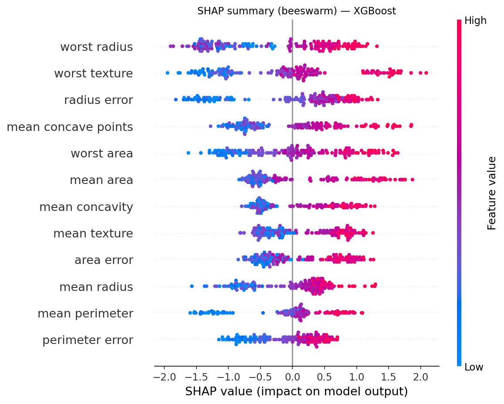
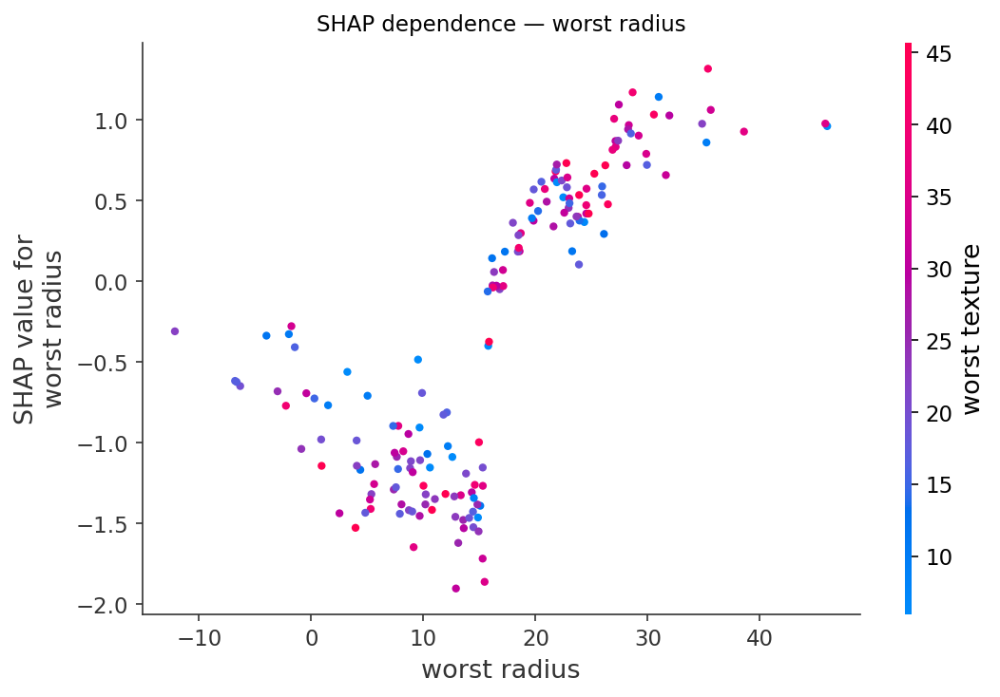

# SHAP — 협력게임이론으로 예측을 해부하기 (수식·알고리즘·함정)

> 의료 인공지능 논문의 **(3) SHAP 분석** 파트를 위한 레퍼런스. Shapley 값의 정의·공리에서 시작해 SHAP의 가법 설명 틀, 추정 알고리즘(Kernel/Tree/Deep/Linear), 전역 해석, 그리고 *의료에서 반드시 알아야 할 함정*까지 수식과 함께 정리한다.
> 자매 노트: 예측모델은 [17. Predictive Modeling Methods](17.PredictiveModelingMethods.md), 통계검정은 [16. Statistical Testing](16.StatisticalTesting.md), **SHAP를 인과로 오독하는 함정**은 [14. Causal Interpretation Pitfalls](14.CausalInterpretationPitfalls.md)을 함께 본다.
> 본문 예시는 BRCA 벤치마크 SHAP 노트북(`05.SHAP-REVISION.ipynb`)의 실제 사용(CatBoost/XGBoost/LightGBM/RF/Logistic에 TreeExplainer·KernelExplainer·LinearExplainer)에 근거한다. 모든 인용은 실존 문헌이며 말미에 DOI/URL을 단다.

---

## 목차

1. [왜 SHAP인가](#1-왜-shap인가)
2. [Shapley 값 — 협력게임이론](#2-shapley-값--협력게임이론)
3. [네 가지 공리](#3-네-가지-공리)
4. [SHAP — 가법 feature 귀속](#4-shap--가법-feature-귀속)
5. [핵심 모호성 — 조건부 vs 주변 기댓값](#5-핵심-모호성--조건부-vs-주변-기댓값)
6. [추정 알고리즘](#6-추정-알고리즘)
7. [전역 해석 — 요약·중요도·의존도·상호작용](#7-전역-해석--요약중요도의존도상호작용)
8. [의료에서의 함정](#8-의료에서의-함정)
9. [SHAP vs 다른 해석법](#9-shap-vs-다른-해석법)
10. [실무 체크리스트](#10-실무-체크리스트)
11. [실제 적용 사례](#11-실제-적용-사례)
12. [참고문헌](#12-참고문헌)

---

## 1. 왜 SHAP인가

[17번 노트](17.PredictiveModelingMethods.md)의 트리 앙상블·딥러닝은 정확하지만 *블랙박스*다. 의료에서는 "왜 이 환자가 고위험으로 예측되었는가"를 답해야 규제·신뢰·임상 채택이 가능하다. **SHAP(SHapley Additive exPlanations)** *(Lundberg & Lee 2017)* 는

1. **국소(local)**: 한 환자의 예측을 feature 기여로 분해하고,
2. **전역(global)**: 그 국소 설명을 모아 모델 전체의 작동을 이해하며,
3. **이론적 유일성**: 몇 가지 바람직한 공리를 동시에 만족하는 *유일한* 귀속이라는 보장

을 제공한다. 단, 이 보장은 "공정한 *기여* 배분"에 대한 것이지 **인과효과가 아니다**([§8](#8-의료에서의-함정)).

---

## 2. Shapley 값 — 협력게임이론

기원은 1953년 협력게임이론 *(Shapley 1953)*. $N=\{1,\dots,M\}$의 플레이어(=feature)와, 부분집합 $S\subseteq N$의 "성과"를 주는 특성함수 $v(S)$가 있을 때, 전체 성과 $v(N)$을 각 플레이어에게 *공정하게* 나누는 유일한 방법이 Shapley 값이다.

플레이어 $i$의 Shapley 값은 **가능한 모든 합류 순서에 대한 한계기여의 평균**:

$$
\phi_i=\sum_{S\subseteq N\setminus\{i\}}\frac{|S|!\,(M-|S|-1)!}{M!}\,\bigl[\,v(S\cup\{i\})-v(S)\,\bigr]
$$

- $v(S\cup\{i\})-v(S)$: 집합 $S$에 $i$가 합류할 때의 **한계기여**.
- 가중치 $\frac{|S|!(M-|S|-1)!}{M!}$: $i$ 직전까지 정확히 $S$가 모였을 순열의 비율. 모든 $M!$ 순서를 동등하게 평균하는 것과 같다.

예측 설명에서는 $v(S)$ = "feature 부분집합 $S$만 알 때의 모델 출력 기댓값"으로 둔다. $\phi_i$ = feature $i$가 *기준선 대비* 예측을 끌어올리거나 내린 양.

---

## 3. 네 가지 공리

Shapley 값은 다음을 *동시에* 만족하는 유일한 배분이다(그래서 "공정"하다).

1. **효율성(Efficiency / Local accuracy)**: 모든 기여의 합이 전체와 일치.
$$
\sum_{i=1}^{M}\phi_i = v(N)-v(\varnothing)=f(x)-\mathbb{E}[f(X)]
$$
즉 **개별 예측 = 기준선(평균 예측) + 모든 SHAP 값의 합**. 의료 설명에서 "기여를 더하면 이 환자 점수가 된다"는 감사가능성의 핵심.
2. **대칭성(Symmetry)**: 두 feature가 모든 $S$에서 같은 기여면 같은 값.
3. **더미(Dummy/Null player)**: 어떤 $S$에도 기여가 없으면 $\phi_i=0$.
4. **가법성(Additivity/Linearity)**: 두 게임의 합의 Shapley 값 = 각 Shapley 값의 합. (앙상블/트리 합산에 핵심 — TreeSHAP의 기반.)

> SHAP의 "유일성"은 이 공리들을 받아들일 때의 이야기다. 공리 자체가 적절한지(특히 결측 feature 처리)는 [§5](#5-핵심-모호성--조건부-vs-주변-기댓값)에서 갈린다.

---

## 4. SHAP — 가법 feature 귀속

Lundberg & Lee는 LIME, DeepLIFT, layer-wise relevance 등 여러 설명법이 **가법 feature 귀속(additive feature attribution)** 이라는 한 부류로 묶이고, 그중 Shapley 공리를 만족하는 것은 유일하게 SHAP임을 보였다 *(Lundberg & Lee 2017)*. 설명모델은

$$
g(z')=\phi_0+\sum_{i=1}^{M}\phi_i\,z_i',\qquad z'\in\{0,1\}^M
$$

$z_i'=1$은 "feature $i$가 존재(관측)"를 뜻하고, $\phi_0=\mathbb{E}[f(X)]$가 기준선. 이 $\phi_i$가 곧 Shapley 값일 때 local accuracy·missingness·consistency를 만족한다.

**일관성(consistency)**: 모델이 바뀌어 어떤 feature의 한계기여가 (어떤 $S$에서도) 커지면 그 feature의 귀속도 줄지 않는다. 고전적 트리 "gain/split-count" 중요도는 이 성질을 위반해 비일관적인데, **TreeSHAP는 만족**한다 *(Lundberg et al. 2018, 2020)* — SHAP가 트리 중요도를 대체하는 이론적 이유.

---

## 5. 핵심 모호성 — 조건부 vs 주변 기댓값

"$S$만 알 때의 출력 $v(S)$"를 정의하려면 *빠진 feature를 어떻게 처리*할지 정해야 한다. 두 선택이 다른 SHAP를 만든다 *(Sundararajan & Najmi 2020; Chen et al. 2020)*.

- **주변(marginal / interventional)**: 빠진 feature를 데이터 분포에서 *독립적으로* 끼워넣음.
$$
v(S)=\mathbb{E}_{X_{\bar S}}\bigl[f(x_S, X_{\bar S})\bigr]
$$
모델 함수 자체에 충실("true to the model"). TreeSHAP의 `feature_perturbation="interventional"`, KernelSHAP 기본.
- **조건부(conditional / observational)**: 관측된 $x_S$를 *조건*으로 한 분포에서 끼워넣음.
$$
v(S)=\mathbb{E}_{X_{\bar S}\mid X_S=x_S}\bigl[f(x_S, X_{\bar S})\bigr]
$$
데이터의 상관구조에 충실("true to the data") *(Aas et al. 2021)*.

**왜 중요한가**: feature가 상관될 때 둘은 크게 다르다. 주변식은 데이터에 없는 비현실적 조합(예: 폐경 전인데 폐경 후 호르몬 수치)을 평가할 수 있고, 조건부식은 상관된 feature끼리 기여를 *나눠 가져* "쓰이지 않은 feature"에도 0이 아닌 값을 줄 수 있다. **무엇을 보고하는지 명시**하라 — 이 선택이 의료 해석을 바꾼다.

---

## 6. 추정 알고리즘

정확한 Shapley 값은 $2^M$ 부분집합을 요구해 계산 불가능. 모델 구조별 근사·정확 알고리즘:

### 6-1. KernelSHAP (모델 불가지론)

LIME의 가중 선형회귀로 Shapley 값을 *추정* *(Lundberg & Lee 2017; Ribeiro et al. 2016)*. 부분집합 $z'$를 Shapley 커널

$$
\pi(z')=\frac{M-1}{\binom{M}{|z'|}\,|z'|\,(M-|z'|)}
$$

로 가중해 $g$를 최소제곱 적합하면 그 계수가 $\phi_i$로 수렴. **장점**: 어떤 모델에도 적용(우리 노트북의 `KernelExplainer`). **단점**: 표본 추출 기반이라 느리고 분산 존재, 기본은 주변식(독립 가정).

### 6-2. TreeSHAP (트리 앙상블 정확·고속)

트리 구조를 이용해 **다항시간**에 *정확한* Shapley 값을 계산 *(Lundberg et al. 2018, 2020)*. 한 관측에 대해 $O(TLD^2)$($T$=트리 수, $L$=잎 수, $D$=깊이)로, KernelSHAP의 지수 복잡도를 제거. RF/XGBoost/LightGBM/CatBoost에 직접 적용(우리 주 분석의 `TreeExplainer`). interventional·tree_path_dependent(조건부 근사) 모드를 선택할 수 있다([§5](#5-핵심-모호성--조건부-vs-주변-기댓값)).

### 6-3. DeepSHAP / GradientSHAP (신경망)

DeepLIFT의 기준선 대비 기여 규칙을 Shapley 근사와 결합(DeepSHAP), 또는 Integrated Gradients *(Sundararajan et al. 2017)* 와 기댓값을 결합(GradientSHAP). CNN·Transformer 임베딩 모델 해석에 사용.

### 6-4. LinearSHAP (선형/로지스틱)

선형모델은 닫힌형:

$$
\phi_i=\beta_i\,\bigl(x_i-\mathbb{E}[X_i]\bigr)
$$

feature 독립 가정 시 정확. 로지스틱 회귀 해석(우리 노트북의 `LinearExplainer`)에서 OR 해석과 자연 연결.

| Explainer | 적용 모델 | 정확/근사 | 비용 |
|---|---|---|---|
| **TreeExplainer** | RF·GBM·XGB·LGBM·CatBoost | 정확(다항시간) | 낮음 |
| **LinearExplainer** | 선형·로지스틱 | 정확(독립 가정) | 매우 낮음 |
| **KernelExplainer** | 임의 | 근사(표본) | 높음 |
| **Deep/GradientExplainer** | 신경망 | 근사 | 중간 |

---

## 7. 전역 해석 — 요약·중요도·의존도·상호작용

국소 $\phi_i$를 데이터 전체에 대해 모으면 전역 통찰이 된다 *(Lundberg et al. 2020)*.

- **전역 중요도**: 평균 절대 SHAP $\;I_j=\frac{1}{n}\sum_{i=1}^{n}|\phi_j^{(i)}|$. 일관성 보장이 있어 트리 gain 중요도보다 신뢰성 높음.
- **Summary(beeswarm) plot**: feature별로 모든 표본의 $\phi$를 점으로, 색=feature 값. 방향·크기·분산을 한 그림에. (우리 노트북의 `beeswarm`/`summary_plot`.)

  

  > 각 점=한 환자, 가로=그 feature의 SHAP 기여(오른쪽=악성 위험↑), 색=feature 값(빨강 높음). "worst radius·worst texture가 클수록 위험↑"가 한눈에 읽힌다. (TreeExplainer, interventional; 생성: [`assets/make_figures.py`](assets/make_figures.py))
- **Dependence plot**: $x_j$ vs $\phi_j$ 산점도 — 비선형·임계효과를 드러냄(예: Ki-67 14% 부근의 꺾임). 색으로 상호작용 feature 자동 표시.

  

  > 가로=feature 실제값, 세로=그 feature의 SHAP 값. 단조 증가·포화·임계점 같은 *함수 모양*을 드러내고, 색은 자동 선택된 상호작용 feature를 표시한다.
- **SHAP interaction values** *(Lundberg et al. 2020)*: Shapley interaction index로 쌍별 상호작용을 분해.
$$
\phi_{i,j}=\sum_{S\subseteq N\setminus\{i,j\}}\frac{|S|!\,(M-|S|-2)!}{2\,(M-1)!}\,\nabla_{ij}(S),\quad
\nabla_{ij}(S)=v(S\cup\{i,j\})-v(S\cup\{i\})-v(S\cup\{j\})+v(S)
$$
대각합은 주효과, 비대각은 상호작용. TreeSHAP가 정확히 계산.
- **Force / waterfall plot**: 한 환자의 $\phi_0$에서 출발해 각 feature가 예측을 밀고 당기는 경로(효율성 공리의 시각화).

---

## 8. 의료에서의 함정

> 리뷰어가 가장 날카롭게 보는 지점. SHAP의 강점이 동시에 오용의 원천이다.

1. **SHAP ≠ 인과효과.** SHAP는 *모델이* 무엇을 쓰는지를 설명할 뿐, *세계가* 어떻게 작동하는지가 아니다. "SHAP가 높으니 이 변수를 바꾸면 결과가 바뀐다"는 추론은 틀릴 수 있다 *(Janzing et al. 2020; Chen et al. 2020)*. 교란·역인과·collider가 그대로 SHAP에 반영된다 — 상세 사례는 [14. Causal Interpretation Pitfalls](14.CausalInterpretationPitfalls.md). 보고 시 **"association, model-based"** 로 한정하라.
2. **상관 feature의 귀속 분산.** 강하게 상관된 feature들은 기여를 나눠 가져 개별 중요도가 *희석*되거나 비현실적 조합에서 평가된다([§5](#5-핵심-모호성--조건부-vs-주변-기댓값)). 라디오믹스(shape 계열 공선성)에서 흔함.
3. **주변 vs 조건부 미명시.** 어떤 기준값(baseline)·어떤 기댓값을 썼는지 안 밝히면 재현 불가. interventional/observational을 명시.
4. **feature 중요도로서의 한계** *(Kumar et al. 2020)*: Shapley 값은 "게임의 공정 배분"이지 인간이 기대하는 "중요도"와 항상 일치하지 않는다 — 정렬 순위를 과신하지 말 것.
5. **적대적 조작 가능** *(Slack et al. 2020)*: post-hoc 설명은 공격적으로 왜곡될 수 있다(예: 편향을 숨기는 모델). 설명을 *감사 근거*로 쓸 땐 주의.
6. **불안정성·표본의존.** KernelSHAP·배경(background) 데이터 선택에 따라 값이 흔들림. 배경셋·시드를 고정하고 보고.
7. **단위·기준.** 분류는 보통 log-odds(margin) 공간에서 합산되므로, 확률 공간 해석 시 변환에 유의.

---

## 9. SHAP vs 다른 해석법

| 방법 | 범위 | 모델 | 이론보장 | 비고 |
|---|---|---|---|---|
| **SHAP** | local+global | 임의(구조별 가속) | Shapley 공리 | 일관·가법, 비용·상관 주의 |
| **LIME** *(Ribeiro 2016)* | local | 임의 | 없음 | 빠르나 불안정 |
| **Permutation importance** | global | 임의 | — | 상관 feature 왜곡 |
| **Integrated Gradients** *(Sundararajan 2017)* | local | 미분가능 | 공리(민감도·구현불변) | 신경망 전용 |
| **Partial Dependence / ALE** | global | 임의 | — | 평균 효과, 상관 시 PDP 편향 |
| **Attention weights** | local | Transformer | 없음 | 설명으로 과신 금물 |
| **내재적 해석(EBM·선형·얕은 트리)** | global | 자체 | 설계상 | 사후설명 불필요([05번](05.Boosting.md)·[14번](14.CausalInterpretationPitfalls.md)) |

> 통합 관점: 많은 제거기반(removal-based) 설명이 하나의 틀로 묶인다 *(Covert et al. 2021)*. 인과지식을 넣고 싶으면 비대칭 Shapley *(Frye et al. 2020)* 등이 있으나, 가정이 명시적이어야 한다.

---

## 10. 실무 체크리스트

- [ ] 모델에 맞는 explainer를 썼는가(트리→TreeExplainer, 선형→LinearExplainer, 그 외→Kernel/Deep)?
- [ ] **주변 vs 조건부**(interventional/observational)와 배경 데이터셋을 명시했는가?
- [ ] 효율성(local accuracy) 점검: $\phi_0+\sum_i\phi_i = f(x)$ 가 성립하는가?
- [ ] log-odds vs 확률 공간을 구분해 보고했는가?
- [ ] 전역 중요도(평균 |SHAP|)·beeswarm·dependence를 함께 제시했는가?
- [ ] 해석을 **"association, model-based"** 로 한정하고 인과주장을 피했는가([14번](14.CausalInterpretationPitfalls.md))?
- [ ] 상관·공선성 feature의 귀속 분산을 논의했는가?
- [ ] 시드·배경셋·버전을 고정해 재현성을 확보했는가?

---

## 11. 실제 적용 사례

BRCA 벤치마크 SHAP 노트북(`05.SHAP-REVISION.ipynb`)의 워크플로:

1. **모델별 explainer 매칭**: 부스팅(CatBoost/XGBoost/LightGBM)·RF → `TreeExplainer`(정확·고속), 로지스틱 → `LinearExplainer`(닫힌형), 임의 비교 모델 → `KernelExplainer`.
2. **전역**: 평균 |SHAP|로 feature 순위, `beeswarm`으로 방향성. 임상·판독소견·라디오믹스 feature의 상대 기여를 한 그림에 비교.
3. **국소**: 대표 환자의 waterfall로 "$\phi_0$(평균 위험) → 각 feature 기여 → 개별 예측"을 감사가능하게 제시(효율성 공리).
4. **의존도·상호작용**: dependence plot으로 grade·Ki-67·entropy의 비선형 임계효과, interaction value로 쌍별 효과.
5. **보고 한정**: 모든 해석을 *모델 기반 연관*으로 한정하고, 상관 feature 귀속·주변식 가정을 Limitations에 명시 — [16번 §16](16.StatisticalTesting.md)·[14번 노트](14.CausalInterpretationPitfalls.md)의 경고를 준수.

**한 줄 결론**: SHAP는 "모델이 무엇을 보는가"를 공정·일관·가법적으로 보여주는 강력한 렌즈다. 그러나 그것을 "세계가 무엇 때문에 그러한가"로 바꿔 읽는 순간, 통계가 아니라 *오해석*이 된다.

---

## 부록 — 실습 코드 (Python)

모델 구조에 맞는 explainer 선택, **효율성 공리 검증**, 전역/국소 시각화. 전체 그림은 [`assets/make_figures.py`](assets/make_figures.py).

```python
import numpy as np, shap

# (1) 트리 앙상블(RF/XGB/LGBM/CatBoost) → TreeExplainer (정확·고속)
#     interventional = 주변(marginal) 기댓값([§5]); background 데이터 명시
explainer = shap.TreeExplainer(model, feature_perturbation="interventional", data=X_background)
sv = explainer(X_test)                      # sv.values: (n, M) SHAP 행렬

# (2) 효율성(local accuracy) 공리 점검: phi0 + sum(phi_i) == f(x)
base = explainer.expected_value
recon = base + sv.values.sum(axis=1)        # 모델 margin(log-odds)과 일치해야 함
assert np.allclose(recon, model.predict(X_test, output_margin=True), atol=1e-3)

# (3) 전역 중요도 = 평균 |SHAP|
importance = np.abs(sv.values).mean(axis=0)
order = np.argsort(importance)[::-1]

# (4) 시각화
shap.summary_plot(sv.values, X_test, feature_names=feat)          # beeswarm
shap.dependence_plot(feat[order[0]], sv.values, X_test, feature_names=feat)
shap.plots.waterfall(sv[0])                                       # 한 환자 국소 분해
```

```python
# (5) 선형/로지스틱 → LinearExplainer (닫힌형 phi_i = beta_i (x_i - E[x_i]))
lin_expl = shap.LinearExplainer(logit_model, X_background)
sv_lin = lin_expl(X_test)

# (6) 임의 모델(블랙박스) → KernelExplainer (모델 불가지론, 느림)
#     배경셋은 대표 표본으로 요약(shap.kmeans)해 비용을 줄인다
bg = shap.kmeans(X_background, 50)
kern = shap.KernelExplainer(model.predict_proba, bg)
sv_kern = kern.shap_values(X_test[:100], nsamples=200)

# (7) 쌍별 상호작용 (TreeExplainer 정확)
inter = shap.TreeExplainer(model).shap_interaction_values(X_test)  # (n, M, M)
```

> 보고 시 반드시 명시: ① explainer 종류, ② **주변 vs 조건부**(`feature_perturbation`), ③ background 데이터셋·시드, ④ margin(log-odds) vs 확률 공간. 그리고 해석은 **"association, model-based"** 로 한정([§8](#8-의료에서의-함정), [14번 노트](14.CausalInterpretationPitfalls.md)).

---

## 12. 참고문헌

모두 실존 문헌. DOI/안정 URL 직접 확인.

### 이론 기초
- Shapley L.S. (1953). *A Value for n-Person Games.* In: Kuhn H.W., Tucker A.W. (eds.), *Contributions to the Theory of Games II* (Annals of Mathematics Studies 28), 307–317. Princeton Univ. Press. https://doi.org/10.1515/9781400881970-018
- Lundberg S.M., Lee S.-I. (2017). *A Unified Approach to Interpreting Model Predictions.* NeurIPS 30:4765–4774. https://proceedings.neurips.cc/paper/2017/hash/8a20a8621978632d76c43dfd28b67767-Abstract.html

### 알고리즘
- Lundberg S.M., Erion G.G., Lee S.-I. (2018). *Consistent Individualized Feature Attribution for Tree Ensembles.* arXiv:1802.03888. https://arxiv.org/abs/1802.03888
- Lundberg S.M., Erion G., Chen H., DeGrave A., Prutkin J.M., Nair B., Katz R., Himmelfarb J., Bansal N., Lee S.-I. (2020). *From Local Explanations to Global Understanding with Explainable AI for Trees.* Nature Machine Intelligence 2(1):56–67. https://doi.org/10.1038/s42256-019-0138-9
- Ribeiro M.T., Singh S., Guestrin C. (2016). *"Why Should I Trust You?": Explaining the Predictions of Any Classifier (LIME).* KDD '16:1135–1144. https://doi.org/10.1145/2939672.2939778
- Štrumbelj E., Kononenko I. (2010). *An Efficient Explanation of Individual Classifications using Game Theory.* JMLR 11:1–18. https://www.jmlr.org/papers/v11/strumbelj10a.html
- Štrumbelj E., Kononenko I. (2014). *Explaining Prediction Models and Individual Predictions with Feature Contributions.* Knowledge and Information Systems 41(3):647–665. https://doi.org/10.1007/s10115-013-0679-x
- Sundararajan M., Taly A., Yan Q. (2017). *Axiomatic Attribution for Deep Networks (Integrated Gradients).* ICML, PMLR 70:3319–3328. https://proceedings.mlr.press/v70/sundararajan17a.html
- Covert I., Lundberg S., Lee S.-I. (2021). *Explaining by Removing: A Unified Framework for Model Explanation.* JMLR 22(209):1–90. https://jmlr.org/papers/v22/20-1316.html

### 모호성·가정
- Sundararajan M., Najmi A. (2020). *The Many Shapley Values for Model Explanation.* ICML, PMLR 119:9269–9278. https://proceedings.mlr.press/v119/sundararajan20b.html
- Aas K., Jullum M., Løland A. (2021). *Explaining Individual Predictions When Features Are Dependent: More Accurate Approximations to Shapley Values.* Artificial Intelligence 298:103502. https://doi.org/10.1016/j.artint.2021.103502
- Janzing D., Minorics L., Blöbaum P. (2020). *Feature Relevance Quantification in Explainable AI: A Causal Problem.* AISTATS, PMLR 108:2907–2916. https://proceedings.mlr.press/v108/janzing20a.html
- Frye C., Rowat C., Feige I. (2020). *Asymmetric Shapley Values: Incorporating Causal Knowledge into Model-Agnostic Explainability.* NeurIPS 33:1229–1239. https://proceedings.neurips.cc/paper/2020/hash/0d770c496aa3da6d2c3f2bd19e7b9d6b-Abstract.html

### 비판·함정
- Chen H., Janizek J.D., Lundberg S., Lee S.-I. (2020). *True to the Model or True to the Data?* arXiv:2006.16234. https://arxiv.org/abs/2006.16234
- Kumar I.E., Venkatasubramanian S., Scheidegger C., Friedler S. (2020). *Problems with Shapley-Value-Based Explanations as Feature Importance Measures.* ICML, PMLR 119:5491–5500. https://proceedings.mlr.press/v119/kumar20e.html
- Slack D., Hilgard S., Jia E., Singh S., Lakkaraju H. (2020). *Fooling LIME and SHAP: Adversarial Attacks on Post hoc Explanation Methods.* AIES '20:180–186. https://doi.org/10.1145/3375627.3375830

### 교과서·도구
- Molnar C. (2025). *Interpretable Machine Learning: A Guide for Making Black Box Models Explainable* (3rd ed.). https://christophm.github.io/interpretable-ml-book/
- SHAP 라이브러리(공식): https://shap.readthedocs.io/ · https://github.com/shap/shap

---

*관련 노트: [17. Predictive Modeling Methods](17.PredictiveModelingMethods.md) · [16. Statistical Testing](16.StatisticalTesting.md) · [14. Causal Interpretation Pitfalls](14.CausalInterpretationPitfalls.md)*
